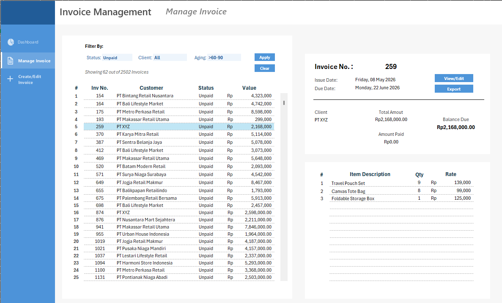
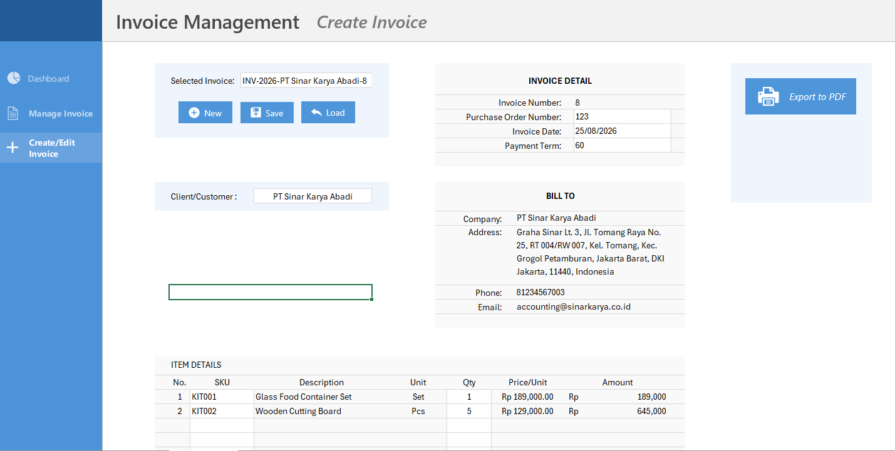
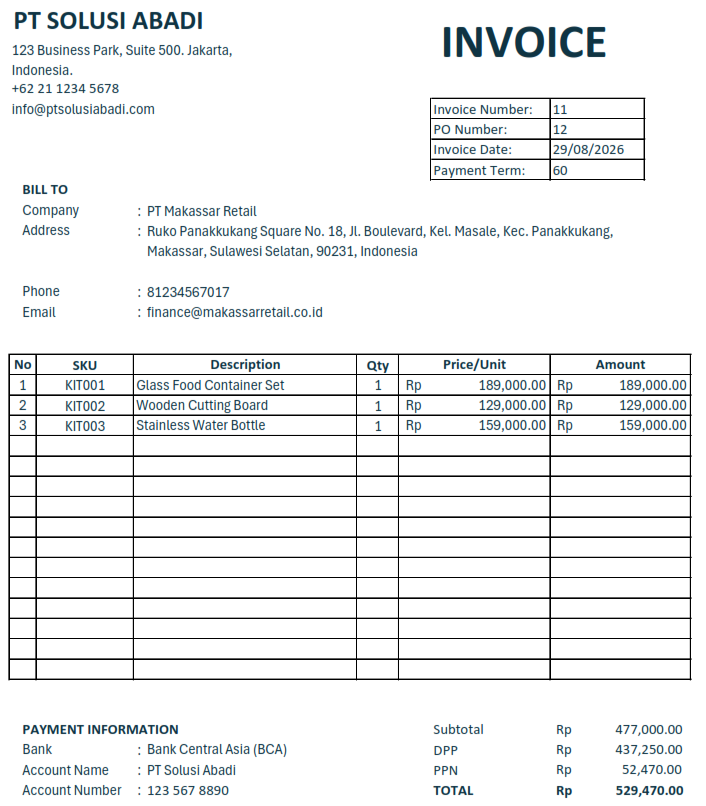

> 🚧 **Project Status:** This project is currently under active development.  
> Features and source code will continue to be updated as the system is expanded.

## Changelog

### September 2026
- Added Manage Invoice page.
- Added Status, Customer, and aging filtering.
- Added helper-range filtering using `FILTER()`, `LET()`, and `CHOOSECOLS()`.
- Added preview invoice from active selected cell
- Added dynamic scrollable invoice list.


### August 2026
- Added Create Invoice interface.
- Added Save Invoice to databases workflow. 
- Added Load Invoice from databases workflow.
- Added export invoice to PDF feature.

<br>

# 📑 Excel VBA Project: "Automated Invoicing System"


> An **Microsoft Excel + VBA** invoice management system designed to create, store, search, manage, and export invoices to PDF from a single workbook.

## Project Overview

This project was developed to simplify invoice administration that would otherwise be handled manually. Excel is used as both the user interface and a lightweight database, while VBA manages automation such as invoice creation, transaction storage, invoice searching, filtering, and PDF export.

**Project Type:** Excel Automation / Invoice Management  
**Technology:** Microsoft Excel, VBA, Excel Tables, Form Controls, Lookup Formulas  
**File Format:** `.xlsm`

---

## Preview

### Manage Invoice



The **Manage Invoice** page is used to review invoice records and inspect invoice details without opening the raw database. Users can filter invoices by status, customer, and aging.

### Create / Edit Invoice



The **Create/Edit Invoice** page is used to create new invoices or load existing invoices for editing. Products are selected by SKU, and product information is retrieved automatically from the Product Database.

### Invoice Output



Completed invoice data is transferred into a printable invoice template that can be printed directly or exported as a PDF file.

---

## 🛠️ What I've Learned in this Project So far

### VBA Programming Fundamentals

- Declaring variables using `Dim`.
- Understanding VBA data types such as:
  - `String`
  - `Long`
  - `Double`
  - `Boolean`
  - `Range`
  - `Worksheet`
  - `ListObject`
  - `ListRow`
- Understanding the difference between values and objects.
- Using `Set` when assigning VBA object references.
- Creating reusable `Sub` procedures and `Function` procedures.
- Passing values into procedures using parameters such as `ByVal`.

---

### Control Flow & Data Processing

- Using `For...Next` loops to process multiple invoice line items.
- Using conditional logic with `If...Then`.

Example:

```vb
For i = tbl.ListRows.Count To 1 Step -1

    If tbl.DataBodyRange.Cells(i, invoiceCol).Value = invoiceName Then
        tbl.ListRows(i).Delete
    End If

Next i
```

---

### Excel VBA Object Model

- Working with Excel VBA objects such as:
  - `Workbook`
  - `Worksheet`
  - `Range`
  - `ListObject`
  - `ListRow`
  - `ListColumns`
  - `DataBodyRange`
- Understanding the difference between worksheet-relative and table-relative references.
- Accessing Excel Tables using `ListObjects`.
- Reading and writing data using `Cells(row, column)`.

---

### Excel Formula
  - Using `Let, choosecols, and filter` function to create dynamic display
  - Lookup funtion to retrieve data from databases 

### Excel Form Control
- Adding interactive elements such as scroll bars to create user friendly environment


